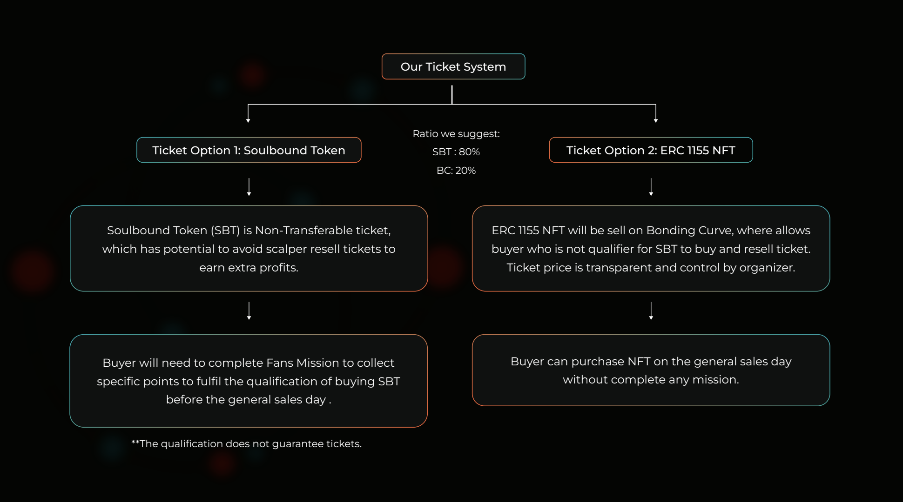
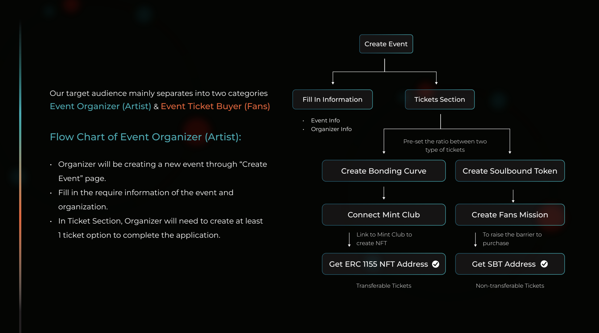

# AR3NA
AR3NA is a web3-based event platform that enables users to host and manage events smoothly. By integrating the Mint Club Protocol, our platform enables the use of Bonding Curve ERC1155 Tokens, which are designed to serve as event tickets. This integration offers a dynamic pricing mechanism that responds to real-time market demand. Additionally, AR3NA supports the use of ERC1155-based Soulbound Tokens (SBTs), specifically designed to restrict ticket transferability and prevent resale, ensuring tickets reach their intended audience and fostering a more equitable ticketing experience. The platform also includes a whitelist feature, allowing event organizers to precisely control who can claim tickets, thus enhancing the customization and management of events.

## Why Use Bonding Curve?
- **Dynamic Pricing Mechanism:** The use of Bonding Curve NFTs allows for dynamic pricing, where ticket prices automatically rise with increasing demand and fall as demand decreases. This mechanism helps event organizers to maximize their revenue by ensuring that ticket prices adjust in real time to the market demand.

- **Impact of Information Transparency:** The Bonding Curve model is typically associated with higher levels of market transparency, meaning that all participants can see how ticket prices change in response to demand. This transparency reduces the asymmetry of information, making it difficult for scalpers to exploit buyers lacking market information. Buyers are better informed about how ticket prices evolve over time and may opt to purchase at lower prices directly, rather than buying at inflated prices from scalpers.

- **Increased Scalper Risk:** The Bonding Curve's dynamic pricing mechanism elevates the risk for scalpers by requiring them not only to buy tickets early, hoping for a rise in demand and prices, but also to precisely predict when demand and prices will peak. This dual challenge significantly increases their risk. A misjudgment in predicting demand peaks can lead to purchasing at too high a price, reducing the margin for profitable resale. This heightened unpredictability and risk could deter scalping.

## Soulbound Token
While the dynamic pricing mechanism of the Bonding Curve offers several advantages, it can also lead to consumer confusion or dissatisfaction due to constant price fluctuations, especially if buyers feel they have paid too much or discover prices have dropped later. Additionally, rapid price increases for high-demand tickets may deter scalpers but also exclude genuine fans with limited budgets. Therefore, we offer event organizers the option to use Bonding Curve, Soulbound Tokens, or a combination of both for ticket issuance.

- **Non-Transferability:** Once a Soulbound Token (SBT) ticket is claimed, it becomes tied to the buyer's digital identity, making it impossible to transfer or sell to another party. This ensures that tickets reach their intended audience, reducing the risk of scalping.

- **Whitelist Control:** Event organizers have the capability to create and manage a whitelist, specifying who is eligible to claim tickets. This feature not only restricts access to genuine participants but also allows for targeted distribution strategies, such as prioritizing long-time fans or specific community members.

Soulbound Token (Sepolia): [0x417E845982933d37F1b473b5A03F660f9e32466b](https://sepolia.etherscan.io/address/0x417e845982933d37f1b473b5a03f660f9e32466b)